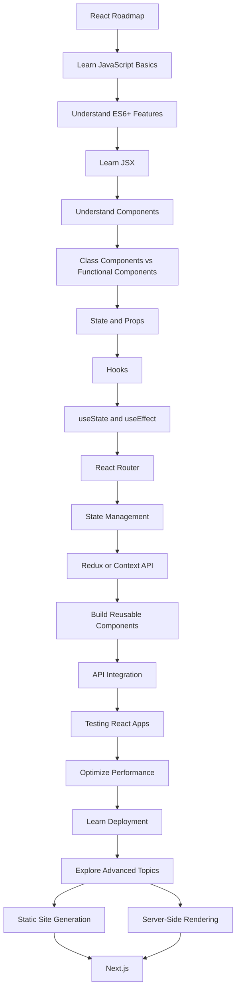

# Reactify Workshop - Overview

This repository is a part of the **Reactify Workshop** aimed at teaching key concepts of **React** development. The workshop covers various aspects of React, including component-based architecture, state management, hooks, and UI styling using **Tailwind CSS**. 

In this repository, you will find a hands-on project focused on building a simple yet aesthetically appealing card component using **React**.

---

## Topics of Discussion

1. **Introduction to React**
   - What is React?
   - Why use React over traditional JavaScript?
   - React’s component-based architecture
   - JSX and its role in React

2. **React vs Traditional JavaScript**
   - Key differences between React and Vanilla JavaScript
   - How React simplifies UI development and state management

3. **React Components: Class vs Functional**
   - Understanding Class Components and Functional Components
   - Introduction to **useState** and **useEffect** hooks in functional components

4. **State Management**
   - Tools like **Context API**.

5. **Tailwind CSS**
   - How to use Tailwind CSS in React projects
   - Utility-first CSS for building responsive and customizable UIs

6. **React Folder Structure and Best Practices**
   - Best practices for organizing React projects
   - File structure and naming conventions
   - Reusable components and separation of concerns

7. **React Flowstate for Developers**
   - Understanding workflow in React development


---

## Getting Started

### Prerequisites

- [Node.js](https://nodejs.org/) (v14 or later)
- npm or yarn package manager

### Installation

1. Clone the repository:

   ```bash
   git clone https://github.com/your-username/reactify-project.git
   cd reactify-project
   ```
2. Install Dependencies
    ```bash
    npm install
    ```
3. Start the development server 
    ```bash
    npm start
    ```

## Features

- **Responsive Design**: The card component is fully responsive and adjusts based on screen size.
- **Tailwind CSS**: The project uses Tailwind CSS for utility-first styling, making it easy to customize and extend.
- **Component-Based Architecture**: React components are reusable, making it easier to maintain and scale the UI.

---

## Roadmap 




## License

This project is licensed under the MIT License.

---

## Contact

For questions or suggestions, feel free to open an issue or contact me directly.

